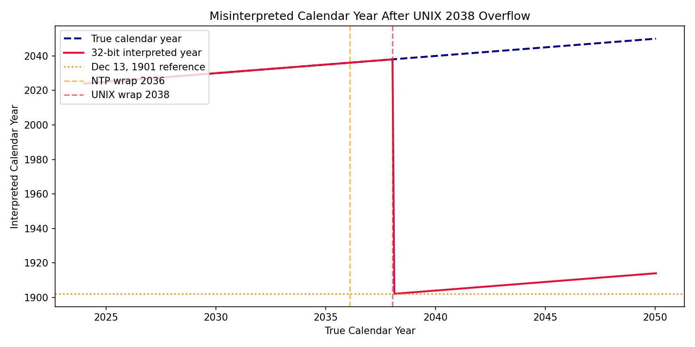
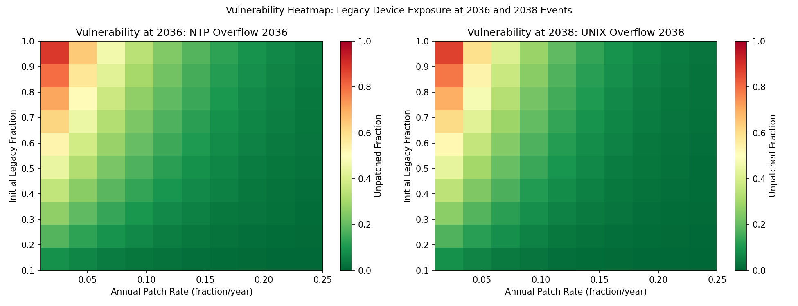

# It's about Time — Executable Simulator

Executable simulator automatically generated from Vinton Cerf's ["It's about Time"](https://doi.org/10.1145/3799690) (*Communications of the ACM*, April 2026) — models NTP 2036 and UNIX 2038 timestamp overflow hazards under five remediation scenarios.

Generated by the [DBbun](https://dbbun.com) document-to-simulator pipeline.

## Overview

Cerf's column warns that two timestamp overflow events — the NTP 32-bit wrap-around on February 6, 2036 and the UNIX 32-bit signed-integer overflow on January 19, 2038 — pose real risks to legacy embedded, IoT, and medical devices. The column is prose: no datasets, no code, no simulation parameters.

This repository contains an executable simulator derived entirely from that one-page column. The pipeline extracted 12 quantitative parameters from Cerf's text, assumed 5 reasonable defaults, and generated a complete simulation environment: Python source code, five remediation scenarios, synthetic datasets, and eight publication-quality figures.

A video walkthrough of the process is available: [Turning Vint Cerf's CACM Essay into a Runnable Simulation](https://www.youtube.com/watch?v=w7ja1vgIQZ4).

## Quick Start

```bash
pip install numpy matplotlib
python Simulator.py
```

Output is written to `./sim_outputs/` by default. Use `--output <path>` to specify a different directory.

## Repository Contents

```
├── Simulator.py            # Generated Python simulator (832 lines)
├── Spec.json               # Extraction specification (parameters, scenarios, figures)
├── Documentation.pdf       # Full documentation with parameter tables and figure descriptions
├── README.md
└── sim_outputs/
    ├── fig1_ntp_counter.png          # NTP 32-bit counter wrap-around
    ├── fig2_unix_counter.png         # UNIX 32-bit signed counter overflow
    ├── fig3_interpreted_unix_year.png # Misinterpreted calendar year after 2038
    ├── fig4_time_error.png           # Time interpretation error (seconds)
    ├── fig5_legacy_fraction.png      # Unpatched device fraction under 5 scenarios
    ├── fig6_overflow_events.png      # Overflow event timeline
    ├── fig7_heatmap.png              # Vulnerability heatmap (patch rate × legacy fraction)
    ├── fig8_ntp_era.png              # NTPv4 era-aware vs legacy systems
    ├── parameters_used.csv           # All 17 model parameters
    ├── scenario_summary.csv          # Summary statistics per scenario
    └── simulation_outputs.csv        # Full time-series output (1,590 rows × 19 columns)
```

## Scenarios

| Scenario | Patch Rate | Initial Legacy Fraction | Description |
|----------|-----------|------------------------|-------------|
| no_patch_legacy_only | 0% | 100% | Worst case — all devices unpatched through 2050 |
| slow_patch_baseline | 5%/yr | 40% | Gradual enterprise/IoT upgrade cycle |
| aggressive_patch_campaign | 20%/yr | 40% | Coordinated response analogous to Y2K |
| ntp_era_aware_systems | 5%/yr | 40% | NTPv4 era handling, UNIX overflow unaddressed |
| high_legacy_slow_patch | 2%/yr | 70% | Long-lifecycle medical/industrial devices |

## Sample Figures

**Misinterpreted calendar year after UNIX 2038 overflow** — the system suddenly reports December 1901:



**Vulnerability heatmap** — legacy device exposure at the 2036 and 2038 events as a function of patch rate and initial legacy fraction:



## Related Publications

- Cerf, V.G. "It's about Time." *Communications of the ACM* 69, 4 (April 2026), 5. [DOI:10.1145/3799690](https://doi.org/10.1145/3799690)
- Kartoun, U. "AI and the Evolving Role of the Scientific Paper." *Communications of the ACM* 69, 4 (April 2026), 6. [DOI:10.1145/3797252](https://doi.org/10.1145/3797252)

## Citation

If you use this simulator in your work, please cite:

```
Kartoun, U. (2026). Executable simulator for "It's about Time" by V.G. Cerf.
DBbun LLC. https://github.com/dbbun/its-about-time-simulator
```

## License

© DBbun LLC. All rights reserved. See [LICENSE](LICENSE) for terms.

## Contact

Uri Kartoun — [uri.kartoun@dbbun.com](mailto:uri.kartoun@dbbun.com) — [dbbun.com](https://dbbun.com)
